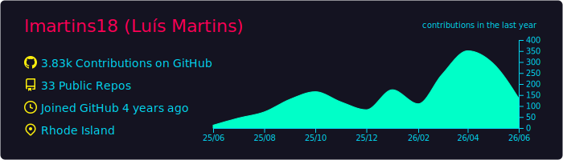
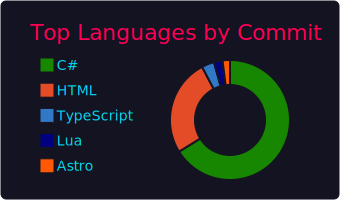

# GitHub Profile Summary

This repo is set up to generate these cards with [`vn7n24fzkq/github-profile-summary-cards`](https://github.com/vn7n24fzkq/github-profile-summary-cards).

To populate the images, add a repository secret named `SUMMARY_GITHUB_TOKEN`, then run the `GitHub Profile Summary Cards` workflow once from the Actions tab.
# stats2
